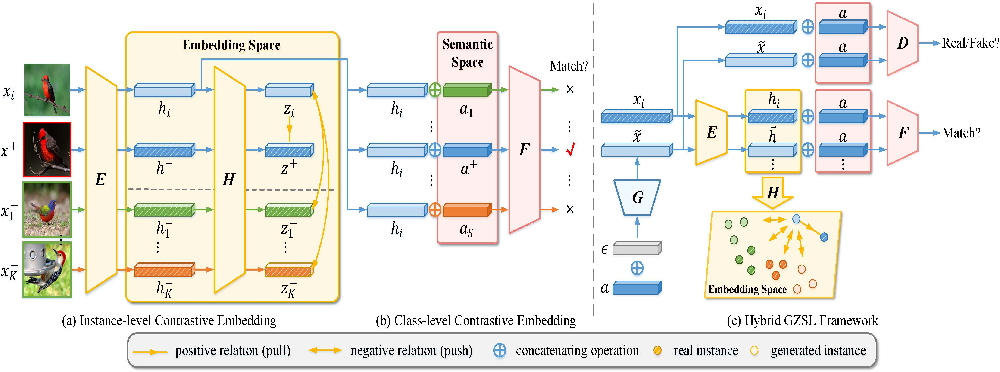

# CE-GZSL

Codes for the CVPR 2021 paper: Contrastive Embedding for Generalized Zero-Shot Learning [[CVPR2021](https://openaccess.thecvf.com/content/CVPR2021/papers/Han_Contrastive_Embedding_for_Generalized_Zero-Shot_Learning_CVPR_2021_paper.pdf)][[arxiv](https://arxiv.org/abs/2103.16173)].

Keras implementation [code](https://github.com/webcsm/ce-gzsl-keras). Much appreciation for @**[webcsm](https://github.com/webcsm)**'s efforts!




## Contrastive Embedding for Generalized Zero-Shot Learning

### Dependencies
This codes requires the following:
- Python 3.6
- Pytorch 1.2.0
- scikit-learn

### Datasets

Download the dataset (AWA1/AWA2/CUB/FLO/SUN) from the work of [Xian et al. (CVPR2017)](http://datasets.d2.mpi-inf.mpg.de/xian/xlsa17.zip), and save correspongding data into directory `./data/`. Here, we provide the semantic descriptor for CUB, which is the 1,024-dimensional class embeddings generated from textual descriptions `sent_splits.mat`.

### Train and Test

Run `python CE_GZSL.py` with the following args:

* `--dataset`: datasets, e.g: CUB.
* `--class_embedding`:  the semantic descriptors to use, e.g: sent or att.
* `--syn_num`: number synthetic features for each class.
* `--batch_size`: the number of the instances in a mini-batch.
* `--attSize`: size of semantic features.
* `--nz`: size of the Gaussian noise.
* `--embedSize`: size of embedding h.
* `--outzSize`: size of non-liner projection z.
* `--nhF`: size of the hidden units comparator network F.

* `--ins_weight`: weight of the classification loss when learning G.
* `--cls_weight`: weight of the score function when learning G.
* `--ins_temp`: temperature in instance-level supervision.
* `--cls_temp`: temperature in class-level supervision

* `--manualSeed`: manual seed.
* `--nclass_all`: number of all classes.
* `--nclass_seen`: number of seen classes

For example:

```bash
python3.6 CE_GZSL.py --dataset CUB --class_embedding sent --syn_num 100 --batch_size 2048 --attSize 1024 --nz 1024 --embedSize 2048 --outzSize 512 --nhF 2048 --ins_weight 0.001 --cls_weight 0.001 --ins_temp 0.1 --cls_temp 0.1 --manualSeed 3483 --nclass_all 200 --nclass_seen 150
```

### Citation

If you find this useful, please cite:
```
@InProceedings{Han_2021_CVPR,
    author    = {Han, Zongyan and Fu, Zhenyong and Chen, Shuo and Yang, Jian},
    title     = {Contrastive Embedding for Generalized Zero-Shot Learning},
    booktitle = {Proceedings of the IEEE/CVF Conference on Computer Vision and Pattern Recognition (CVPR)},
    month     = {June},
    year      = {2021},
    pages     = {2371-2381}
}
```
